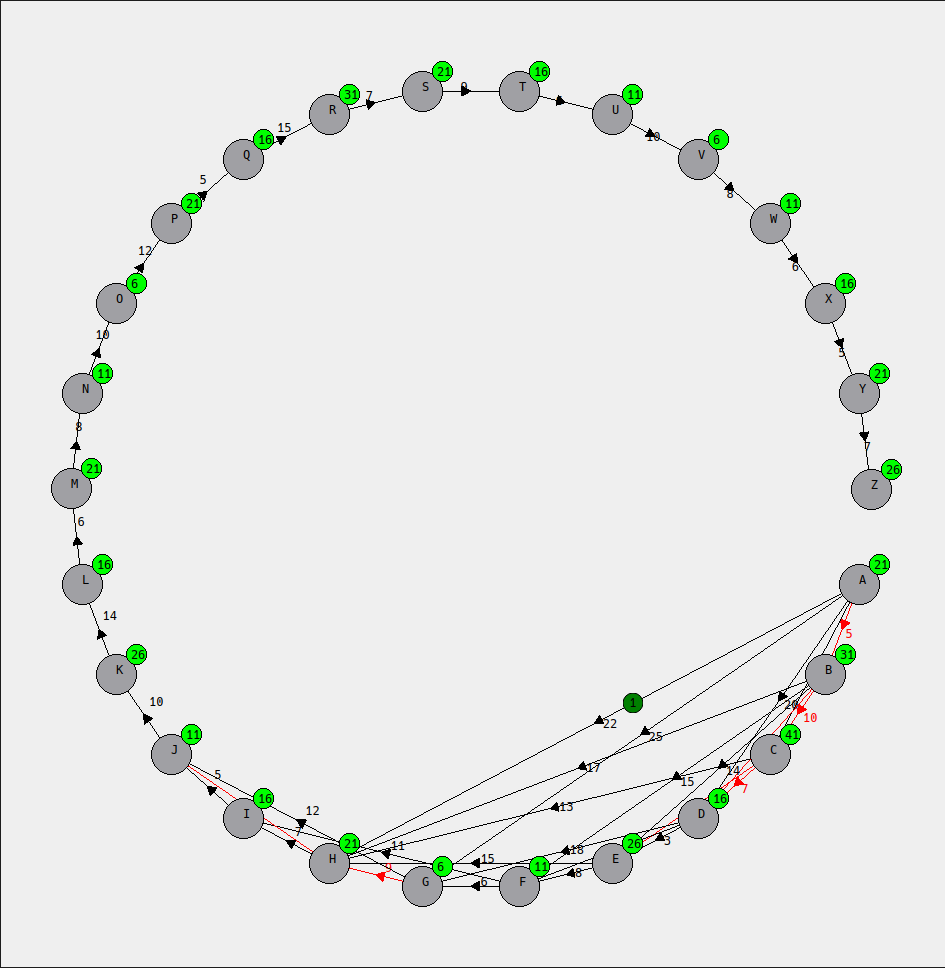

# Road Network Simulation and Visualization

## Overview

This project simulates a road network and vehicle movement using a graph-based approach, visualized through **Qt 6**. 
The application allows users to interact with a map of cities (represented as graph vertices) and roads (edges),
where they can add/remove cities, add/remove roads, block roads, and simulate vehicle movement between cities. 
The program reads input data from CSV files and represents the road network dynamically based on that data, 
with real-time updates to reflect changes made during interaction.

## Features

- **Graph Representation**:
  - Cities are represented as vertices (labeled `A-Z`).
  - Roads between cities are represented as weighted edges.
  - Blocked roads can be marked dynamically.
  - Vehicles can be added, and their movement can be simulated.

- **Interactive Visualization**:
  - Add or remove cities and roads.
  - Right-click on a city for a context menu with options like adding/removing vertices or blocking roads.
  - Vehicles are animated to move between cities based on the current road network.

- **Real-Time Updates**:
  - As the user interacts with the network (blocking roads, adding/removing vertices/edges), the graph and vehicles update in real time.

## Project Structure

This project includes the following components:

1. **`graph.hpp`**: Defines the graph structure (cities and roads) and operations for adding/removing vertices and edges.
2. **`hash_table.hpp`**: Implements a hash table to store vertex-related data, such as blocked roads.
3. **`linklist.hpp`**: Provides a linked list implementation for managing edge and vertex data.
4. **`vehicle.hpp`**: Defines the `Vehicle` class, responsible for vehicle movement across the graph with animation.
5. **`main.cpp`**: The entry point of the application, responsible for setting up the graph, reading input data, initializing the UI, and running the Qt application.
6. **`graphdrawer.cpp`**: Responsible for rendering the graph and handling user interactions.
7. **CSV Input Files**:
   - **`road_network.csv`**: Describes the roads between cities.
   - **`road_closures.csv`**: Contains data about blocked roads.
   - **`vehicles.csv`**: Contains information about the vehicles.

## Prerequisites

Before running this project, ensure you have **Qt 6** installed on your laptop.
sudo apt install qt6-qmake qt6-base-dev

## To run 
1) make
2) ./project

### graph.hpp

Contains the Graph class, which represents the road network. It allows adding/removing vertices (cities) and edges (roads). Key functions include:

  1) addVertex(): Adds a city to the graph.
  2) removeVertex(): Removes a city from the graph.
  3) removeVertex(): Removes a city from the graph.
  4) removeEdge(): Removes a road between two cities.
  
  removeEdge(): Removes a road between two cities.

### hash_table.hpp

This file implements a simple hash table used to store various graph-related data, such as:

  1) Adjacency lists for each vertex (city).
  2) Properties such as blocked roads.

### linklist.hpp

Implements a LinkList and NodeList class for handling dynamic lists of edges and vertices. These are used to manage the graph's adjacency list and other collections of data.
vehicle.hpp

Defines the Vehicle class, which represents a vehicle traveling across the network:

   1) The Vehicle class has properties such as id, from, to, and uses QPropertyAnimation for animating the movement between cities.

### main.cpp

The entry point of the application:

   1) Initializes the graph and reads data from CSV files (road_network.csv, road_closures.csv, vehicles.csv).
   2) Sets up the Qt application and the main window.
   3) Initializes the GraphDrawer widget for rendering the graph and animating vehicle movement.

### graphdrawer.cpp

Handles the rendering of the graph on the screen:

  1) Draws the cities as circles and the roads as lines.
  2) Responds to user input such as mouse clicks and right-clicks.
  3) Manages the visual animations for vehicle movement.
    
#### 1. Min Heap
A Min Heap is a specialized binary tree where each parent node's value is smaller than or equal to its children's values. 
The smallest element is always at the root of the heap. In this code, the Min Heap is used in Dijkstra's Algorithm to efficiently 
manage and retrieve the node with the smallest distance. This allows the algorithm to continually process the node with the shortest 
known distance, updating distances to neighboring nodes. The use of a Min Heap ensures that the algorithm runs efficiently, even on 
large graphs, by quickly finding the node that should be processed next based on its minimal distance.

#### 2. Dijkstra's Algorithm
Dijkstra's Algorithm is a greedy algorithm designed to find the shortest path from a source node to a destination node in a weighted graph.
The algorithm starts by initializing all distances to infinity, except for the source node, which is set to zero.
As it progresses, the algorithm selects the node with the smallest distance (using the Min Heap), updates the distances to its neighbors,
and processes those nodes. This continues until the destination node is reached or all nodes have been processed.
Dijkstra's algorithm is essential for determining the optimal path in scenarios where the weights represent distances or travel times.

#### 3. BFS (Breadth-First Search)
BFS is a graph traversal algorithm that explores nodes level by level, starting from the source node. It uses a queue to keep track of nodes to visit,
ensuring that all neighbors of the current node are visited before moving on to the next level. BFS is particularly useful for finding the shortest path
in unweighted graphs, as it explores all paths of the same length before moving to longer ones. This ensures that when a node is first visited, it is reached
by the shortest possible path from the source. BFS is often used in network analysis and pathfinding tasks.

#### 4. DFS (Depth-First Search)
DFS is a graph traversal algorithm that explores as far as possible down each branch before backtracking. It uses recursion or a stack to visit a node's neighbors
before exploring their neighbors,continuing until it reaches a dead end (a node with no unvisited neighbors). Once all neighbors of a node are visited,
DFS backtracks to explore other unvisited paths.DFS is valuable for tasks that require exploring all possible paths, like searching for specific patterns or
solving problems such as finding connected components in a graph. While it does not guarantee the shortest path, it is useful in applications where deep exploration of the graph is required.

## Conclusion:
In conclusion, this project provides an interactive and dynamic visualization of a road network, allowing users to manage vertices (cities) and edges (roads), simulate vehicle movements,
and observe the effects of road closures. By leveraging key algorithms such as Dijkstra's for shortest path calculation, and BFS/DFS for graph traversal, 
the project efficiently handles complex routing and vehicle simulations. The integration of Qt for graphical rendering and animation enhances user experience, 
providing a visually appealing and responsive interface. This tool serves as a powerful way to simulate and explore traffic networks, road events, 
and other real-world transportation scenarios.

